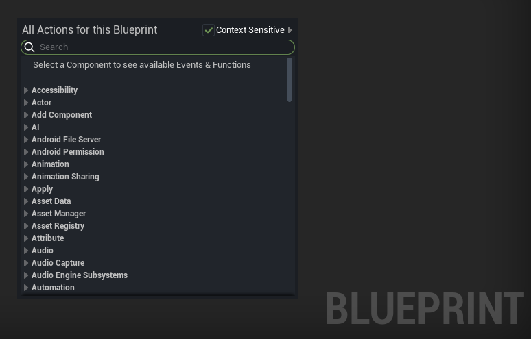
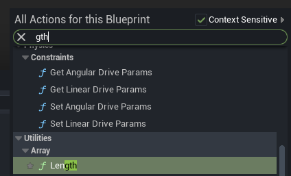
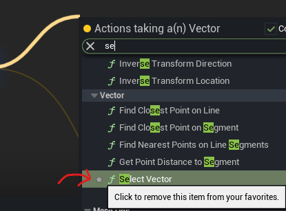
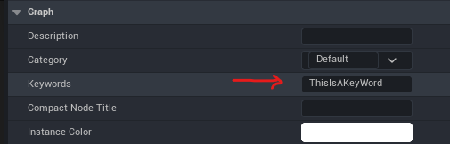
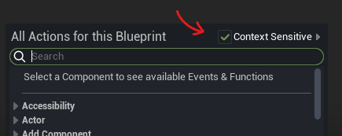

You create a blueprint node by right clicking then searching the node.  
right clicking uses your right hand, and searching might also require your right hand. You'll need to take your hand off your mouse to go to your keyboard, which is slow. Here are some ways to avoid that. (For the most part)  
## Just type it

Some times you can type a part of the full name using only your left hand.  
In the image only typing "gth" gave me the "length" node.
## Favorites

Press this button to add nodes to your favorites. You can also go into Window/Palette to open a window showing your favorited nodes.
Using favorites makes it possible to get your desired node in as less as two characters in this case. (see img)
### A trick.
When getting variables from other actors, let's say the variable you want is called "wall". Typing "get wall" doesn't get you good results, but instead "getwall" does.  
Note: Sometimes this doesn't work?
### Keywords

Adding keywords to your custom functions can help you get better resutls when searching for nodes.
## Other Things
Context Sensitive is recommended to be turned on.

