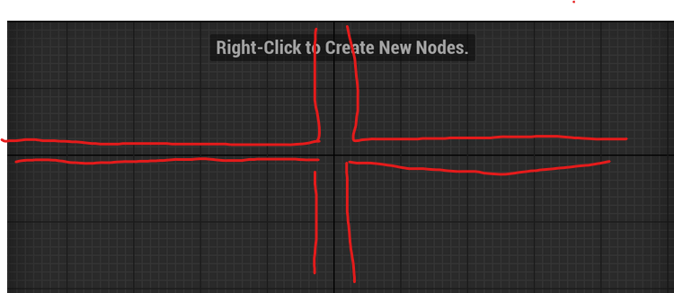
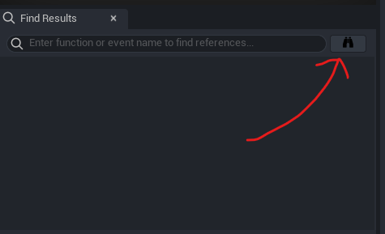

### Windows
You can ctrl+w to close a tab just like a browser, sadly ctrl+shift+t doesn't work.
You can middle click on a tab to close it
#### Tangent
For your browser, you can middle click a link to open it in a new tab, middle clicking an opened tab closes it.
### Viewport Navigation
Left/Right click + Scroll to change your speed
### Can't unsee this now 

There axis lines exist and most of your blueprint graphs aren't actually alined "properly". Good news is this can be turned off in settings. (See my other post for aesthetic tips)
### Search in all blueprints

Press this button to search for something in all blueprints.