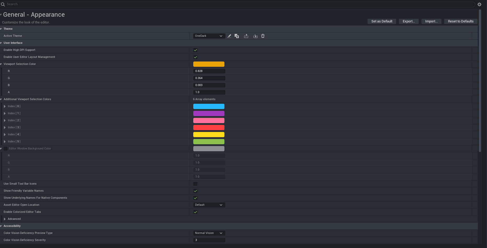
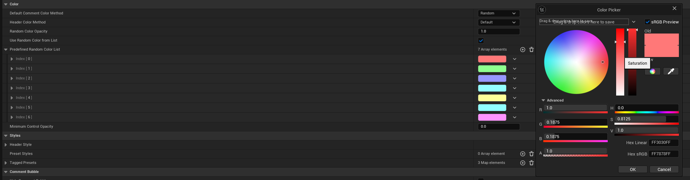
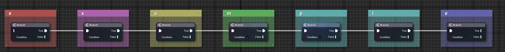

## Aesthetics
#### **Aesthetics plugins**
[Flat nodes](https://www.unrealengine.com/marketplace/en-US/product/flat-nodes), [Crystal Nodes](https://www.unrealengine.com/marketplace/en-US/product/crystal-nodes), [Electronic Nodes](https://www.unrealengine.com/marketplace/en-US/product/electronic-nodes) etc.

#### **Editor Preferences->General->Appearence**
You can change how the editor looks here. This is a theme I am using. 
(I found this theme off google) Feel free to share your own theme!

#### **Auto size comments**
Auto size comments is a free extension that automatically resizes comments.  
The default colors are a bit too vibrant, sometimes having the same color as wires.

You can set a predefined color list, this list is the default list, but every color has it's saturation brought down a bit.  
  
 
I'll add more stuff if I remember.